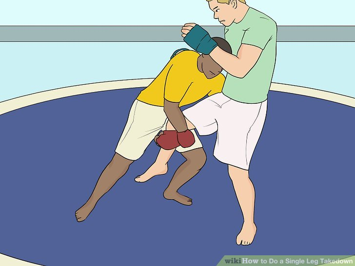

# Single leg

Points Cléfs:

* Tête sur la poitrine de l'adversaire pour éviter qu'il exerce une pression sur notre tête avec ses mains
* Faire une pince avec ses genoux pour bloquer la jambe de l'adversaire

> [!CAUTION]
> Tête à l'intérieur pour éviter la guillotine

> [!TIP]
> Possibilité de positionner ses mains basses pour contrôler le mollet ou la cheville et avoir un contrôle fort

