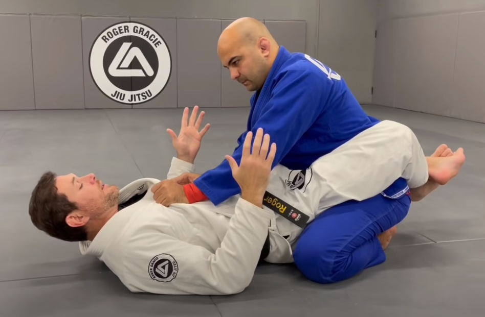

# Garde fermé

La garde fermée est une position fondamentale dans de nombreux sports de combat, caractérisée par le combattant allongé sur le dos, les jambes fléchies et les bras actifs pour protéger et attaquer. Cette posture offre contrôle, défense et opportunités d'attaque, en faisant un élément clé du combat au sol.

