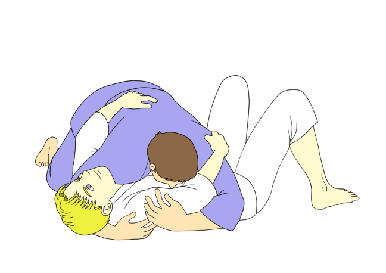

# Side Control

Le Side Control, ou contrôle latéral, est une position essentielle dans de nombreux sports de combat tels que le Jiu-Jitsu brésilien, la lutte et le MMA. Il consiste en un positionnement où un combattant se trouve sur le côté de son adversaire, offrant ainsi un contrôle efficace tout en ouvrant des possibilités d'attaque et de soumission.

Points Cléfs:

* Cross face aka obliger l'adversaire a regarder de l'autre côté en utilisant son épaule pour faire présion sur lui
* Contrôle des hanches pour éviter une recomposition de l'adversaire
* Isolation de son bras grace à ses genoux et hanches
* Eviter a tout prix l'underhook de l'adversaire

